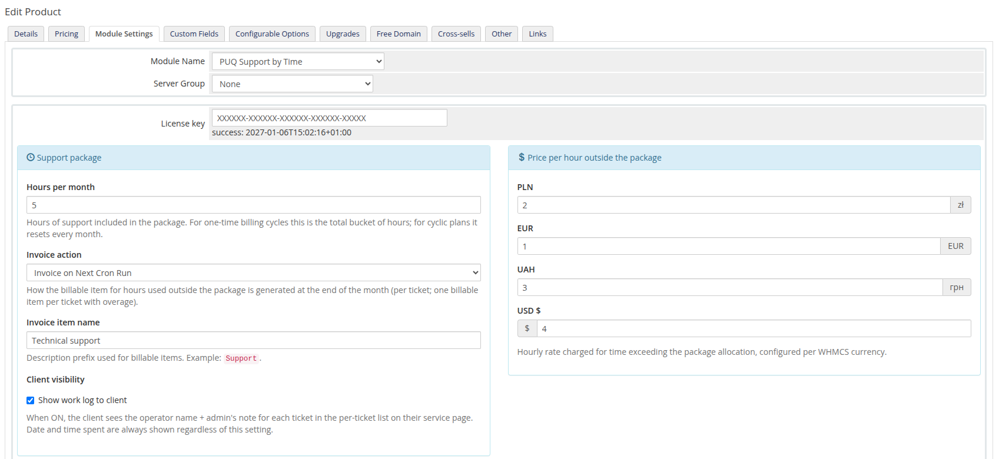
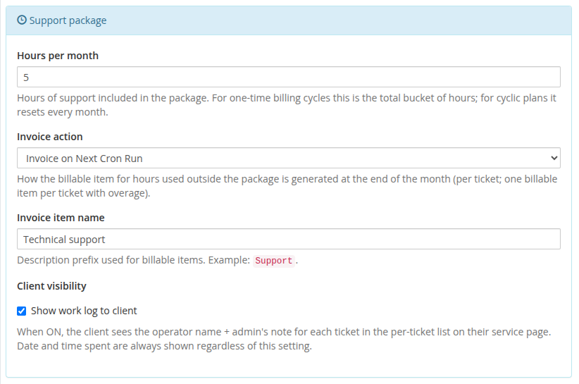
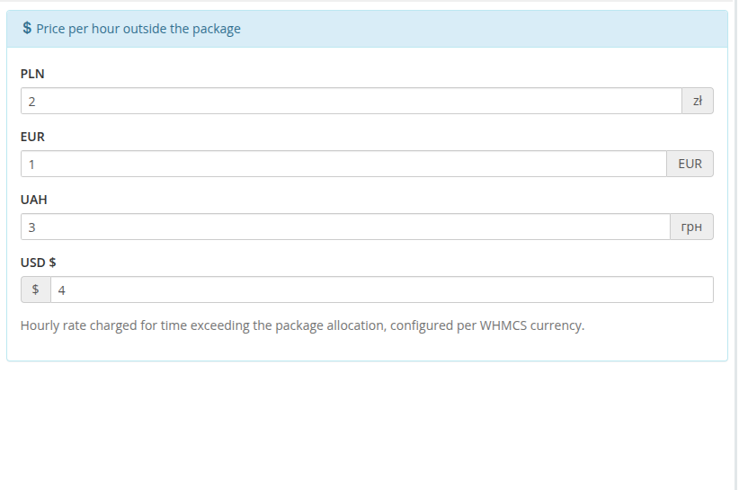
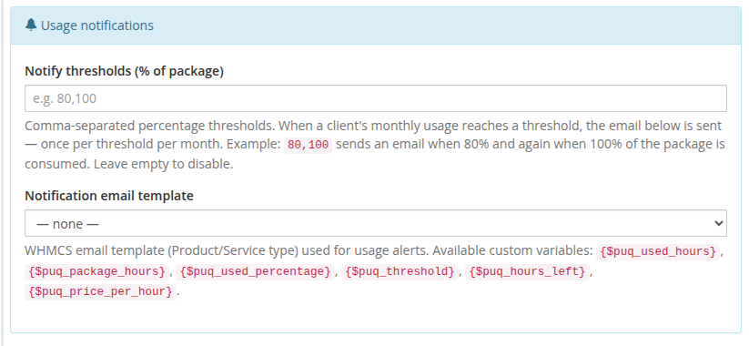

# Product Configuration

### Support by Time module **[WHMCS](https://puqcloud.com/link.php?id=77)**
#####  [Order now](https://puqcloud.com/whmcs-module-support-by-time.php) | [Download](https://download.puqcloud.com/WHMCS/servers/PUQ_WHMCS-Support-by-time/) | [Community](https://community.puqcloud.com/)

## Add a new product to WHMCS

Navigate to **System Settings** → **Products/Services** → **Create a New Product**.

In the **Module Settings** tab select the **PUQ Support by Time** module (leave **Server Group** as *None* — this is a server module without a server). Two billing modes are supported, selected by the product's WHMCS billing cycle:

- **Recurring billing cycle** (Monthly, Quarterly, Annually, …) — the included hours reset every month and overage hours are billed automatically by the daily cron at the end of each month.
- **One Time** — the included hours are a fixed bucket that the service consumes ticket by ticket. When all hours are used, the service is automatically terminated by the next cron run.

---

## Configuration parameters

All settings live in the **Module Settings** tab. Saving the product persists them as a single JSON document in `tblproducts.configoption24` (the license key stays in `configoption1`).

| Parameter | Description |
|-----------|-------------|
| **License key** | A pre-purchased license key for the PUQ Support by Time module. The license must be active for correct operation. After saving, the verification status (and the period it is valid until) is displayed below the field. |
| **Hours per month** | Number of support hours included in the package. For *One Time* billing cycles this is the total bucket of hours. |
| **Invoice action** | How the billable item for overage hours is generated at month-end: **Invoice on Next Cron Run**, **Add to User's Next Invoice**, or **Do not invoice**. |
| **Invoice item name** | Description prefix used for billable items (default: `Support`). The final description is composed as `<name> #<ticket> <YYYY-MM> <hours> Hour(s) (<currency> <rate>/Hour)`. |
| **Show work log to client** | When ON, the client sees the operator name and the per-entry note for each ticket in their service-page ticket list. Date and time spent are always shown regardless of this setting. |
| **Price per hour outside the package** | Hourly rate charged for time exceeding the package allocation, configured per WHMCS currency. |
| **Notify thresholds (% of package)** | Comma-separated percentages (e.g. `80,100`). When a client's monthly usage reaches a threshold, the email template below is sent — once per threshold per month. Empty disables notifications. |
| **Notification email template** | WHMCS Product/Service email template used for usage alerts. Available custom variables: `$puq_used_hours`, `$puq_package_hours`, `$puq_used_percentage`, `$puq_threshold`, `$puq_hours_left`, `$puq_used_hours_outside_package`, `$puq_price_per_hour`, `$puq_currency_prefix`, `$puq_currency_suffix`, `$puq_how_much_pay`. |

### Support package

### Price per hour (per currency)

### Usage notifications

---

## How billing works

### Recurring billing cycle

1. During the month, operators log time on tickets through the **Save time** / **Close ticket and save time** form (or the live timer) in the ticket header. Each save is stored as a separate entry, and the parent ticket record snapshots `package_hours` and `price_hour` the first time it is touched.
2. The first daily cron of the next month scans all support services that have unbilled tickets for the previous month. The package-hour pool is allocated across that service's tickets (oldest first); for every ticket whose hours exceed the remaining pool, **one billable item per ticket** is created for the overage: `overage_hours × price_hour`. The invoice action chosen in the product configuration determines how the billable item appears.
3. Tickets fully covered by the package allocation are flagged as processed (`billableid = 0`) and no billable item is created for them.

### One Time billing cycle

1. Operators log time the same way; each entry deducts hours from the bucket.
2. After the cron run, services that have used 100 % of their hours are automatically terminated through `ModuleTerminate`, and their tickets/entries are flagged so no further billing is attempted.

---

## Important notes

> **Warning:** This module is a **server module** (Products/Services). It cannot be used as an addon. Attempting to use it as an addon will return an error.

> **License gate:** Every entry point (Create / Suspend / Unsuspend / Change Package / Terminate, ticket header, configuration page) verifies the license. If `license.puqcloud.com` is unreachable and the offline cache has expired, module actions fail until connectivity is restored.

> **Configuration storage:** Starting with v3.0 the entire product configuration (hours, invoice action, item name, work-log visibility, per-currency rates, notification settings) is stored as a JSON document in `tblproducts.configoption24`. Existing v2.x installations are migrated automatically — legacy values stored in the old `configoption3` (package settings) and `configoption4` (per-currency price) slots are read transparently when `configoption24` is empty, so no manual reconfiguration is needed. Re-saving the product through the v3.0 form is recommended (it consolidates everything into `configoption24`) but not required.
