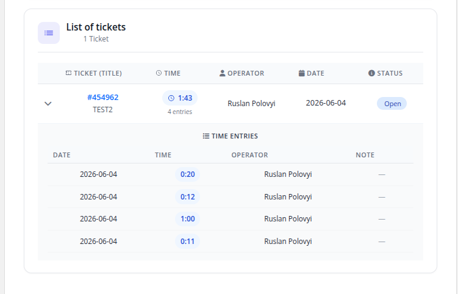

# Home screen

### Support by Time module **[WHMCS](https://puqcloud.com/link.php?id=77)**
#####  [Order now](https://puqcloud.com/whmcs-module-support-by-time.php) | [Download](https://download.puqcloud.com/WHMCS/servers/PUQ_WHMCS-Support-by-time/) | [Community](https://community.puqcloud.com/)

## Client area home screen

After logging in to the client area and opening their support service, the customer sees a modern card-based layout with the following sections.

### This month / Support package

A summary of the current period as three stat cards:

- **Hours of support in the package** — the hour allocation included in the product
- **Hours used this month** (or *Hours used* for One Time) — total hours logged in the current month / bucket
- **Hours left this month** (or *Hours left*) — remaining hours in the allocation

A progress bar shows the percentage of the allocation that has been consumed (it turns amber as the package fills and red at 100 %).

### Billing (recurring billing cycle only)

- **Price per hour** — hourly rate charged for overage hours, in the client's currency
- **Hours outside package** — hours that have already exceeded the included allocation
- **How much to pay this month** — running total of overage cost (`hours outside package × price per hour`)

#### Cost calculator

An interactive predictor: the client enters a number of additional hours and instantly sees the estimated total for the month, with the underlying `overage hours × rate` calculation shown beneath it.

### List of tickets

A table with all tickets that have time logged in the current period:

- Ticket number and title (clickable, opens the ticket), with the number of time entries
- Total time spent (human-readable)
- **Operator** and **Note** — shown only when *Show work log to client* is enabled for the product
- Date of the most recent entry
- A status badge (Open / Billed / Paid / Unpaid)

Each ticket row can be expanded to reveal its individual time entries (date, time, operator, note):

### Sidebar navigation

The client area sidebar contains two menu items:

- **Information** — the home screen described above
- **History** — per-month history view (only for recurring billing cycles, see [History](#))

> **Note:** For *One Time* services, only the *Information* tab is shown — there is no per-month history because the service uses a single bucket of hours.
