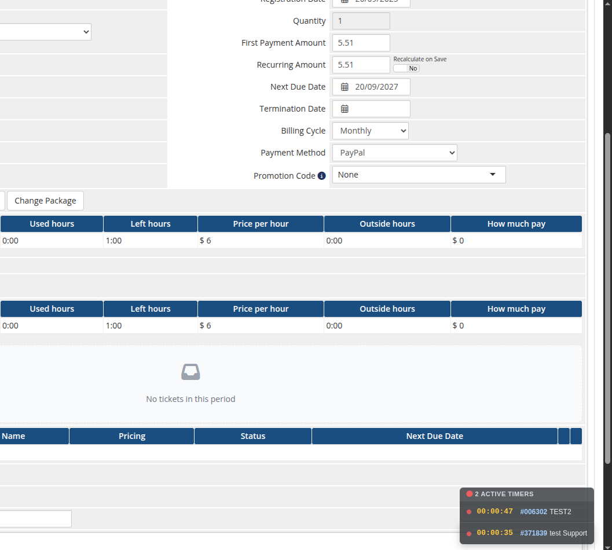
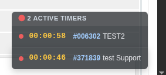

# Product Home Screen

### Support by Time module **[WHMCS](https://puqcloud.com/link.php?id=77)**
#####  [Order now](https://puqcloud.com/whmcs-module-support-by-time.php) | [Download](https://download.puqcloud.com/WHMCS/servers/PUQ_WHMCS-Support-by-time/) | [Community](https://community.puqcloud.com/)

## Admin area service page

When the administrator opens a customer's Support by Time service in WHMCS, the module adds the following panels to the service page.

### License verification

If the license is invalid or unreachable, a red bar with the error message is shown. While the license is invalid, the module's lifecycle hooks (Create / Suspend / Unsuspend / Change Package / Terminate) all return errors.

### Summary

A one-row summary table for the current month: month, package hours, used hours, hours left, price per hour, hours outside the package, and the calculated overage amount.

### Operator report

Two side-by-side tables — **This month** and **Last month** — listing each operator who logged time on this service with their total hours and number of entries.

### History (recurring billing cycle)

A row of buttons that switches the **List of tickets** table to any past month for which time has been logged. The current month is the default. Clicking a button reloads the list via AJAX without leaving the WHMCS service page.

### List of tickets

One row per ticket logged in the selected month:

| Column | Description |
|--------|-------------|
| **Ticket** | Ticket number and title (links to the support ticket) |
| **Total** | Total time logged on the ticket, plus the number of entries |
| **Operator** | The operator(s) who logged time |
| **Date** | Date of the most recent entry |
| **Billable Item** | Link to the WHMCS billable item created for this ticket (if any) |
| **Invoice** | Link to the invoice that contains the billable item |
| **Status** | Open / Billed / Paid / Unpaid |

Expanding a ticket row reveals its **time entries** (date, time, note, operator) — each with **Edit** and **Delete** actions — followed by the per-ticket **audit trail**. Entries belonging to a ticket that has already been billed are locked (shown with a lock icon instead of the Edit/Delete buttons) so billed time cannot be altered.

Before any time has been logged for the selected month, the tickets list shows an empty state. The panels sit on the WHMCS service page below the standard product/billing fields:

### One Time services

For services with the *One Time* billing cycle the panel is simplified: a single **Status** block with package / used / left hours, and a list of all tickets that have consumed hours from the bucket.

---

## Floating active-timers widget

On every admin page the module shows a small floating widget in the bottom-right corner listing all timers the current operator has running, each with a live elapsed clock and a link to the ticket. It polls in the background and ticks every second, so a running timer is never lost when navigating away from the ticket.

---

## License alert on the admin homepage

The module also adds an alert to the WHMCS admin **Home** page that lists every Support by Time product whose license is currently invalid or unreachable. Each entry links directly to the corresponding product configuration page so the operator can fix it in one click.
