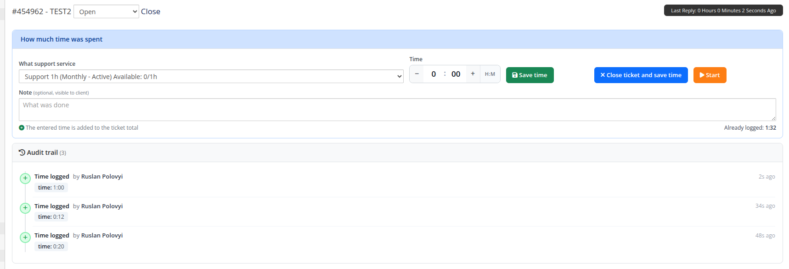
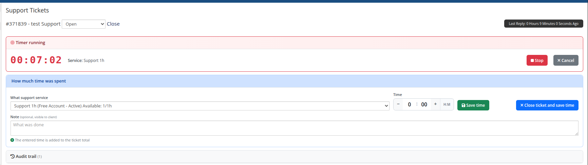
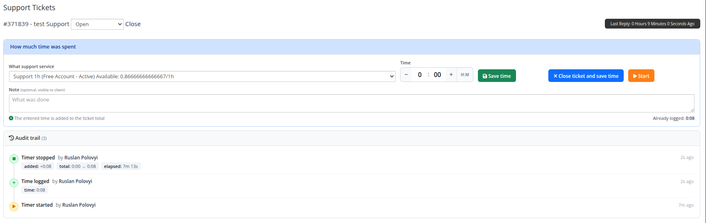
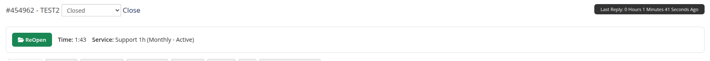
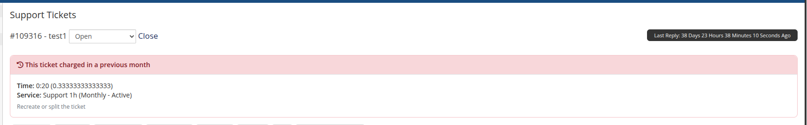
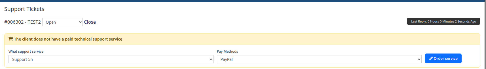

# Ticket header

### Support by Time module **[WHMCS](https://puqcloud.com/link.php?id=77)**
#####  [Order now](https://puqcloud.com/whmcs-module-support-by-time.php) | [Download](https://download.puqcloud.com/WHMCS/servers/PUQ_WHMCS-Support-by-time/) | [Community](https://community.puqcloud.com/)

## Time-logging header

Whenever an administrator opens a ticket in the WHMCS admin area, the module injects a context-aware header above the ticket. The header loads its state over AJAX and renders entirely client-side — every action (save, close, reopen, timer, order) happens **without reloading the page**. It detects the situation (active service, terminated service, no service, ticket charged in a previous month, ticket closed, license issue) and renders the appropriate UI.

---

### Open ticket — time form

The default view is a panel containing:

- A drop-down with the customer's support services. Active services are listed first, then suspended; terminated services are shown disabled. Each entry shows the package allocation and remaining hours: `Service name (cycle - status) Available: 0.46/1h`.
- An **HH:MM** time input with `−` / `+` buttons (minute steps; minutes roll over into hours). For *One Time* services the value is capped at the hours remaining in the bucket.
- An optional **Note** field (visible to the client when *Show work log to client* is enabled on the product).
- Action buttons:
  - **Save time** — appends the entered time as a new entry; the ticket stays open.
  - **Close ticket and save time** — appends the entry and sets the WHMCS ticket status to *Closed*.
  - **Start** — starts a live timer (see below).

> Each save **adds** a new entry to the ticket — it does not overwrite previous entries. The running total ("Already logged") and the full breakdown are shown in the audit trail.

#### Audit trail

Below the form, a timeline lists every action taken on the ticket (time logged, edited, deleted, timer start/stop/cancel, service ordered), with the operator name and a relative timestamp.

---

### Live timer

Pressing **Start** opens a red *Timer running* panel with a server-anchored running clock and **Stop** / **Cancel** buttons. **Stop** rounds the elapsed time up to the nearest minute and appends it as a regular time entry (with the note, if any); **Cancel** discards it.

After stopping, the action is recorded in the audit trail (elapsed time, added hours, new total):

---

### Closed ticket

When the ticket is closed, the header shows a compact summary (logged time + service) plus a **ReOpen** button that switches the WHMCS ticket status back to *Open* so the operator can log more time. If the ticket has already been billed, ReOpen is refused (the time is locked).

---

### Ticket charged in a previous month

If the ticket's time belongs to a previous month, editing is locked: the header shows a red panel with the recorded time, the service, and a hint to **recreate or split the ticket** if more time needs to be logged. This prevents retroactive changes after the monthly billable item has been created.

---

### Service is terminated

If the service the ticket is attached to has been terminated, time editing is also locked and the operator is asked to recreate or split the ticket against an active service.

---

### Client without a support service

If the client does not yet have an Active or Suspended Support by Time service, the header shows an inline order form: a drop-down with all available Support by Time products and a drop-down with available WHMCS payment methods. Submitting it creates a WHMCS order, accepts it, runs auto-setup and reloads the ticket.

---

### License issue

When any of the customer's Support by Time products has an invalid or unreachable license, the header shows a red banner instead of the time form, with the product name and the error message returned by the license server.
