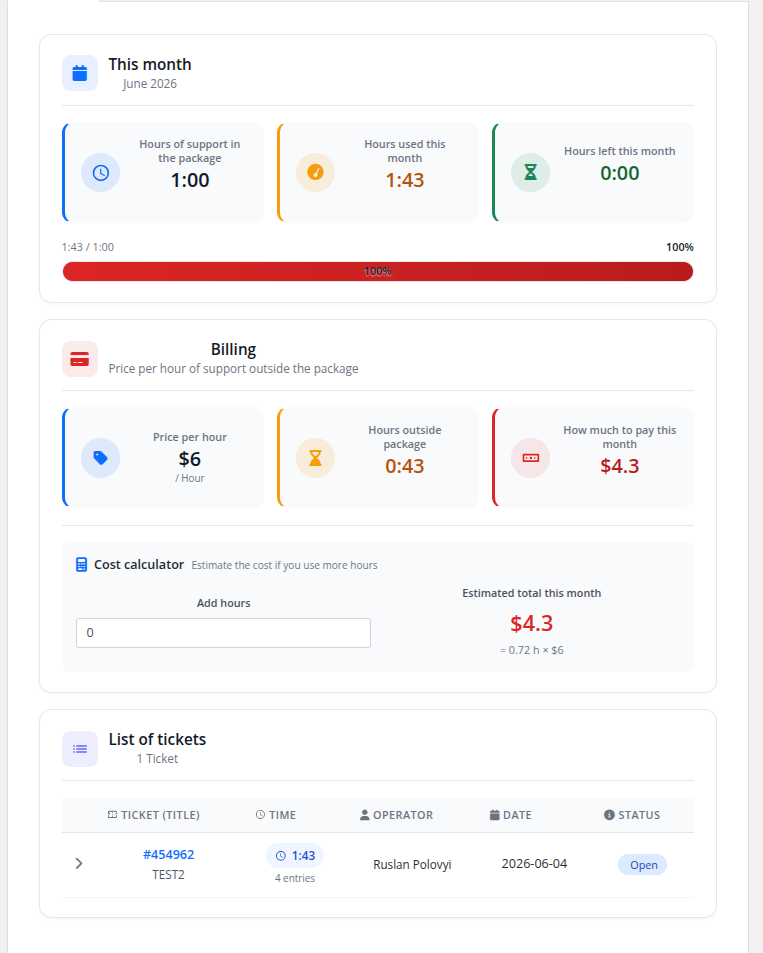
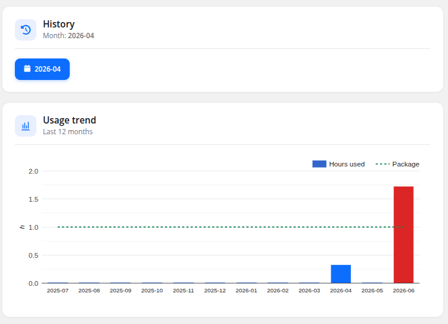
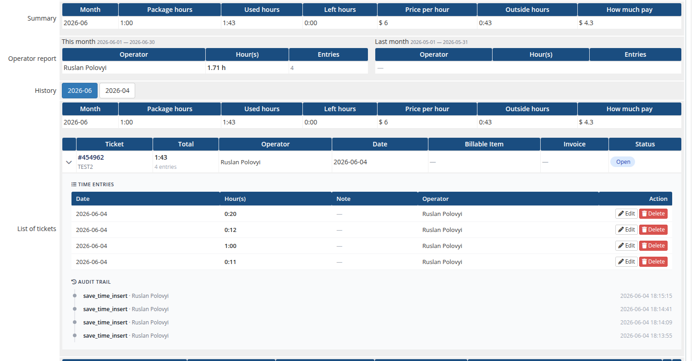
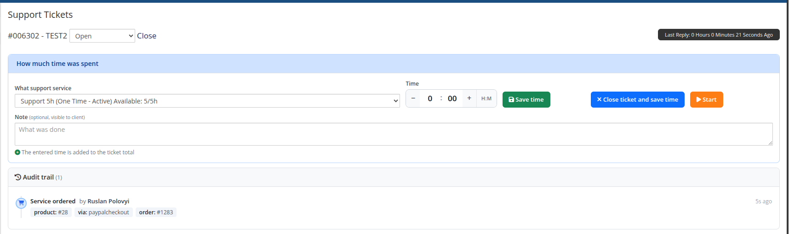

# Description

### Support by Time module **[WHMCS](https://puqcloud.com/link.php?id=77)**
#####  [Order now](https://puqcloud.com/whmcs-module-support-by-time.php) | [Download](https://download.puqcloud.com/WHMCS/servers/PUQ_WHMCS-Support-by-time/) | [Community](https://community.puqcloud.com/)

## Support by Time WHMCS module

The **Support by Time WHMCS module** turns your WHMCS into a fully automated platform for selling paid technical support measured in hours. It lets you sell a recurring support plan that includes a fixed amount of hours per month, with an automatically calculated hourly rate for time used outside the package — or a one-time bucket of hours that the service consumes until it auto-terminates.

Operators log time directly from the ticket page — manually or with a built-in start/stop timer — the module aggregates totals per ticket, per service and per month, keeps a full audit trail of who logged what, and WHMCS billable items are created automatically by the daily cron.

---

## Main features

- **Hour packages** — configurable number of support hours included per month per product
- **Overtime billing** — per-currency hourly rate charged for hours used outside the package
- **Two billing modes** — recurring (monthly reset) or One Time (fixed bucket of hours, auto-terminate when depleted)
- **Time granularity** — time tracked and entered in HH:MM (minute precision)
- **Manual time entry** — operators log spent time directly when responding to a ticket
- **Live timer** — start/stop a server-anchored timer on the ticket; a floating widget shows all running timers on every admin page
- **Multi-entry per ticket** — every save (or timer stop) is recorded as its own entry, so "10 min triage + 30 min fix" is preserved as two lines with individual notes and operators
- **Notes & operator tracking** — each entry stores an optional note and the WHMCS admin who logged it
- **Audit trail** — append-only log of every action (time logged, edited, deleted, timer start/stop/cancel, service ordered, ticket billed) shown on the ticket and on the service page
- **Operator report** — per-operator hours and entry counts for the current and previous month
- **Two save actions** — save time without closing the ticket, or close the ticket and save time
- **Quick service ordering** — when a client without an active support service opens a ticket, the operator can order one straight from the ticket page
- **Ticket protection** — once a ticket has been billed, its time entries are locked against edit/delete/reopen
- **Past-month tickets** — tickets logged in earlier months are flagged as already charged and require splitting/re-creating
- **Automatic monthly billing** — daily cron creates one WHMCS billable item per ticket for the previous month's overage hours
- **Configurable invoice action** — choose between *Invoice on next cron*, *Add to user's next invoice* or *Do not invoice*
- **Usage notifications** — email the client when monthly usage crosses configurable thresholds (e.g. 80%, 100%)
- **Client transparency** — card-based client area with a usage progress bar, an interactive cost calculator and a 12-month usage chart; an optional toggle reveals the operator note + name per ticket
- **Multi-currency** — separate hourly rate per WHMCS-configured currency
- **Multi-language** — 25 languages
- **License verification** — built-in license system with online/offline verification and admin alerts

---

## System requirements & compatibility

The module supports **PHP 7.4, 8.1 and 8.2+**, shipped as a separate ionCube build per PHP version. Download the build that matches the PHP version your WHMCS runs on.

| WHMCS version | PHP version | Module build |
|---------------|-------------|--------------|
| WHMCS 8.x | 7.4 | `php74` |
| WHMCS 8.x | 8.1 | `php81` |
| WHMCS 8.x | 8.2 | `php82` |
| WHMCS 9.x | 8.2 | `php82` |

- **WHMCS 8** → PHP 7.4 / 8.1 / 8.2 (use the matching build).
- **WHMCS 9** → PHP 8.2 (use the `php82` build).
- **PHP 8.2 and newer** (8.3, 8.4, …) → always use the `php82` build.
- **ionCube Loader** v13 or newer (v14, v15) required.

---

## Links

- **Product page:** [https://puqcloud.com/whmcs-module-support-by-time.php](https://puqcloud.com/whmcs-module-support-by-time.php)
- **Documentation:** [https://doc.puq.info/books/support-by-time-whmcs-module](https://doc.puq.info/books/support-by-time-whmcs-module)
- **Support:** [https://puqcloud.com/submitticket.php?step=2&deptid=1](https://puqcloud.com/submitticket.php?step=2&deptid=1)
- **Community:** [https://community.puqcloud.com/](https://community.puqcloud.com/)

---

## Screenshots

### Client area — home screen

### Client area — usage history

### Admin area — service page

### Admin area — ticket time form

